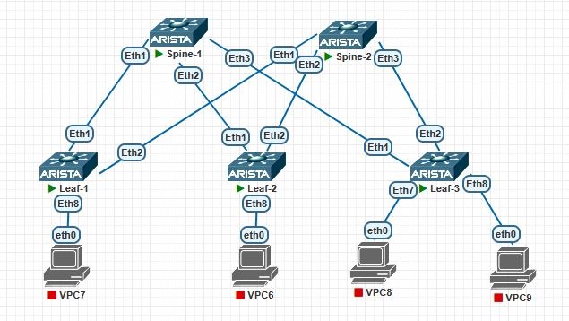

# IP Адрес план

## 1. Проектирование адресного пространства

IP-план предназначен для Leaf-Spine фабрики

Топология:

- 2 × Spine
- 3 × Leaf
- L3 Point-to-Point соединения между каждым Leaf и каждым Spine
---
## 2. Топология


## 3. Адресное пространство

Используется адресное пространство:

```text
10.0.0.0/8
```

| Назначение | Подсеть |
|---|---|
| Spine-1 P2P | `10.0.1.0/24` |
| Spine-2 P2P | `10.0.2.0/24` |
| Loopback0 | `10.255.0.0/24` |

Loopback

| Device | Interface | IP Address |
|---|---|---|
| Spine-1 | Loopback0 | `10.255.0.1/32` | 
| Spine-2 | Loopback0 | `10.255.0.2/32` | 
| Leaf-1 | Loopback0 | `10.255.0.11/32` | 
| Leaf-2 | Loopback0 | `10.255.0.12/32` | 
| Leaf-3 | Loopback0 | `10.255.0.13/32` | 


Сети Point-to-Point

Для соединений Spine ↔ Leaf используются сети `/31`.

Spine-1 P2P

Адресный пул:

```text
10.0.1.0/24
```

| Link | Network | Spine IP | Leaf IP |
|---|---|---|---|
| Spine-1 ↔ Leaf-1 | `10.0.1.0/31` | `10.0.1.0` | `10.0.1.1` |
| Spine-1 ↔ Leaf-2 | `10.0.1.2/31` | `10.0.1.2` | `10.0.1.3` |
| Spine-1 ↔ Leaf-3 | `10.0.1.4/31` | `10.0.1.4` | `10.0.1.5` |

```text
10.0.1.0/31
├── 10.0.1.0  Spine-1
└── 10.0.1.1  Leaf-1

10.0.1.2/31
├── 10.0.1.2  Spine-1
└── 10.0.1.3  Leaf-2

10.0.1.4/31
├── 10.0.1.4  Spine-1
└── 10.0.1.5  Leaf-3
```
Spine-2 P2P

Адресный пул:

```text
10.0.2.0/24
```

| Link | Network | Spine IP | Leaf IP |
|---|---|---|---|
| Spine-2 ↔ Leaf-1 | `10.0.2.0/31` | `10.0.2.0` | `10.0.2.1` |
| Spine-2 ↔ Leaf-2 | `10.0.2.2/31` | `10.0.2.2` | `10.0.2.3` |
| Spine-2 ↔ Leaf-3 | `10.0.2.4/31` | `10.0.2.4` | `10.0.2.5` |

```text
10.0.2.0/31
├── 10.0.2.0  Spine-2
└── 10.0.2.1  Leaf-1

10.0.2.2/31
├── 10.0.2.2  Spine-2
└── 10.0.2.3  Leaf-2

10.0.2.4/31
├── 10.0.2.4  Spine-2
└── 10.0.2.5  Leaf-3
```

## 4. Конфигурация оборудования
<details>
<summary>Spine-1</summary>

Spine-1#sh run
! Command: show running-config
! device: Spine-1 (vEOS-lab, EOS-4.33.1.1F)
!
! boot system flash:/vEOS-lab.swi
!
no aaa root
!
no service interface inactive port-id allocation disabled
!
transceiver qsfp default-mode 4x10G
!
service routing protocols model multi-agent
!
hostname Spine-1
!
spanning-tree mode mstp
!
interface Ethernet1
   no switchport
   ip address 10.0.1.0/31
!
interface Ethernet2
   no switchport
   ip address 10.0.1.2/31
!
interface Ethernet3
   no switchport
   ip address 10.0.1.4/31
!
interface Ethernet4
!
interface Ethernet5
!
interface Ethernet6
!
interface Ethernet7
!
interface Ethernet8
!
interface Loopback0
   ip address 10.255.0.1/32
!
interface Management1
!
ip routing
!
router multicast
   ipv4
      software-forwarding kernel
   !
   ipv6
      software-forwarding kernel
!
end

</details>

Spine-2
```
Spine-2#sh run
! Command: show running-config
! device: Spine-2 (vEOS-lab, EOS-4.33.1.1F)
!
! boot system flash:/vEOS-lab.swi
!
no aaa root
!
no service interface inactive port-id allocation disabled
!
transceiver qsfp default-mode 4x10G
!
service routing protocols model multi-agent
!
hostname Spine-2
!
spanning-tree mode mstp
!
interface Ethernet1
   no switchport
   ip address 10.0.2.0/31
!
interface Ethernet2
   no switchport
   ip address 10.0.2.2/31
!
interface Ethernet3
   no switchport
   ip address 10.0.2.4/31
!
interface Ethernet4
!
interface Ethernet5
!
interface Ethernet6
!
interface Ethernet7
!
interface Ethernet8
!
interface Loopback0
   ip address 10.255.0.2/32
!
interface Management1
!
ip routing
!
router multicast
   ipv4
      software-forwarding kernel
   !
   ipv6
      software-forwarding kernel
!
end

```
Leaf-1
```
Leaf-1#sh run
! Command: show running-config
! device: Leaf-1 (vEOS-lab, EOS-4.33.1.1F)
!
! boot system flash:/vEOS-lab.swi
!
no aaa root
!
no service interface inactive port-id allocation disabled
!
transceiver qsfp default-mode 4x10G
!
service routing protocols model multi-agent
!
hostname Leaf-1
!
spanning-tree mode mstp
!
interface Ethernet1
   description to Spine-1
   no switchport
   ip address 10.0.1.1/31
!
interface Ethernet2
   description to Spine-2
   no switchport
   ip address 10.0.2.1/31
!
interface Ethernet3
!
interface Ethernet4
!
interface Ethernet5
!
interface Ethernet6
!
interface Ethernet7
!
interface Ethernet8
!
interface Loopback0
   ip address 10.255.0.11/32
!
interface Management1
!
ip routing
!
router multicast
   ipv4
      software-forwarding kernel
   !
   ipv6
      software-forwarding kernel
!
end

```
Leaf-2
```
Leaf-2#sh run
! Command: show running-config
! device: Leaf-2 (vEOS-lab, EOS-4.33.1.1F)
!
! boot system flash:/vEOS-lab.swi
!
no aaa root
!
no service interface inactive port-id allocation disabled
!
transceiver qsfp default-mode 4x10G
!
service routing protocols model multi-agent
!
hostname Leaf-2
!
spanning-tree mode mstp
!
system l1
   unsupported speed action error
   unsupported error-correction action error
!
interface Ethernet1
   description to Spine-1
   no switchport
   ip address 10.0.1.3/31
!
interface Ethernet2
   description to Spine-2
   no switchport
   ip address 10.0.2.3/31
!
interface Ethernet3
!
interface Ethernet4
!
interface Ethernet5
!
interface Ethernet6
!
interface Ethernet7
!
interface Ethernet8
!
interface Loopback0
   ip address 10.255.0.12/32
!
interface Management1
!
ip routing
!
router multicast
   ipv4
      software-forwarding kernel
   !
   ipv6
      software-forwarding kernel
!
end

```
Leaf-3
```
Leaf-3#sh run
! Command: show running-config
! device: Leaf-3 (vEOS-lab, EOS-4.33.1.1F)
!
! boot system flash:/vEOS-lab.swi
!
no aaa root
!
no service interface inactive port-id allocation disabled
!
transceiver qsfp default-mode 4x10G
!
service routing protocols model multi-agent
!
hostname Leaf-3
!
spanning-tree mode mstp
!
interface Ethernet1
   description to Spine-1
   no switchport
   ip address 10.0.1.5/31
!
interface Ethernet2
   no switchport
   ip address 10.0.2.5/31
!
interface Ethernet3
!
interface Ethernet4
!
interface Ethernet5
!
interface Ethernet6
!
interface Ethernet7
!
interface Ethernet8
!
interface Loopback0
   ip address 10.255.0.13/32
!
interface Management1
!
ip routing
!
router multicast
   ipv4
      software-forwarding kernel
   !
   ipv6
      software-forwarding kernel
!
end

```

## 5. Проверка
Проверяем связность Spine-Leaf

Spine-1-Leaf-1
```
Spine-1#ping 10.0.1.1
PING 10.0.1.1 (10.0.1.1) 72(100) bytes of data.
80 bytes from 10.0.1.1: icmp_seq=1 ttl=64 time=12.5 ms
80 bytes from 10.0.1.1: icmp_seq=2 ttl=64 time=2.68 ms
80 bytes from 10.0.1.1: icmp_seq=3 ttl=64 time=1.98 ms
80 bytes from 10.0.1.1: icmp_seq=4 ttl=64 time=1.81 ms
80 bytes from 10.0.1.1: icmp_seq=5 ttl=64 time=2.06 ms

--- 10.0.1.1 ping statistics ---
5 packets transmitted, 5 received, 0% packet loss, time 43ms
rtt min/avg/max/mdev = 1.814/4.210/12.514/4.162 ms, pipe 2, ipg/ewma 10.639/8.205 ms
```
Spine-1-Leaf-2
```
Spine-1#ping 10.0.1.3
PING 10.0.1.3 (10.0.1.3) 72(100) bytes of data.
80 bytes from 10.0.1.3: icmp_seq=1 ttl=64 time=6.77 ms
80 bytes from 10.0.1.3: icmp_seq=2 ttl=64 time=3.41 ms
80 bytes from 10.0.1.3: icmp_seq=3 ttl=64 time=1.60 ms
80 bytes from 10.0.1.3: icmp_seq=4 ttl=64 time=2.15 ms
80 bytes from 10.0.1.3: icmp_seq=5 ttl=64 time=2.17 ms

--- 10.0.1.3 ping statistics ---
5 packets transmitted, 5 received, 0% packet loss, time 24ms
rtt min/avg/max/mdev = 1.604/3.220/6.774/1.873 ms, ipg/ewma 6.047/4.915 ms
```
Spine-1-Leaf-3
```
Spine-1#ping 10.0.1.5
PING 10.0.1.5 (10.0.1.5) 72(100) bytes of data.
80 bytes from 10.0.1.5: icmp_seq=1 ttl=64 time=6.21 ms
80 bytes from 10.0.1.5: icmp_seq=2 ttl=64 time=3.37 ms
80 bytes from 10.0.1.5: icmp_seq=3 ttl=64 time=2.61 ms
80 bytes from 10.0.1.5: icmp_seq=4 ttl=64 time=2.41 ms
80 bytes from 10.0.1.5: icmp_seq=5 ttl=64 time=2.31 ms

--- 10.0.1.5 ping statistics ---
5 packets transmitted, 5 received, 0% packet loss, time 23ms
rtt min/avg/max/mdev = 2.312/3.380/6.207/1.460 ms, ipg/ewma 5.691/4.722 ms
```
Spine-2-Leaf-1
```
Spine-2#ping 10.0.2.1
PING 10.0.2.1 (10.0.2.1) 72(100) bytes of data.
80 bytes from 10.0.2.1: icmp_seq=1 ttl=64 time=2.46 ms
80 bytes from 10.0.2.1: icmp_seq=2 ttl=64 time=2.49 ms
80 bytes from 10.0.2.1: icmp_seq=3 ttl=64 time=2.37 ms
80 bytes from 10.0.2.1: icmp_seq=4 ttl=64 time=2.16 ms
80 bytes from 10.0.2.1: icmp_seq=5 ttl=64 time=2.30 ms

--- 10.0.2.1 ping statistics ---
5 packets transmitted, 5 received, 0% packet loss, time 10ms
rtt min/avg/max/mdev = 2.162/2.357/2.490/0.118 ms, ipg/ewma 2.493/2.402 ms
```
Spine-2-Leaf-2
```
Spine-2#ping 10.0.2.3
PING 10.0.2.3 (10.0.2.3) 72(100) bytes of data.
80 bytes from 10.0.2.3: icmp_seq=1 ttl=64 time=2.77 ms
80 bytes from 10.0.2.3: icmp_seq=2 ttl=64 time=2.35 ms
80 bytes from 10.0.2.3: icmp_seq=3 ttl=64 time=1.74 ms
80 bytes from 10.0.2.3: icmp_seq=4 ttl=64 time=1.32 ms
80 bytes from 10.0.2.3: icmp_seq=5 ttl=64 time=1.64 ms

--- 10.0.2.3 ping statistics ---
5 packets transmitted, 5 received, 0% packet loss, time 11ms
rtt min/avg/max/mdev = 1.324/1.966/2.774/0.524 ms, ipg/ewma 2.797/2.339 ms

```
Spine-2-Leaf-3
```
Spine-2#ping 10.0.2.5
PING 10.0.2.5 (10.0.2.5) 72(100) bytes of data.
80 bytes from 10.0.2.5: icmp_seq=1 ttl=64 time=2.77 ms
80 bytes from 10.0.2.5: icmp_seq=2 ttl=64 time=1.86 ms
80 bytes from 10.0.2.5: icmp_seq=3 ttl=64 time=1.63 ms
80 bytes from 10.0.2.5: icmp_seq=4 ttl=64 time=1.71 ms
80 bytes from 10.0.2.5: icmp_seq=5 ttl=64 time=1.89 ms

--- 10.0.2.5 ping statistics ---
5 packets transmitted, 5 received, 0% packet loss, time 18ms
rtt min/avg/max/mdev = 1.629/1.972/2.768/0.409 ms, ipg/ewma 4.601/2.358 ms
```
