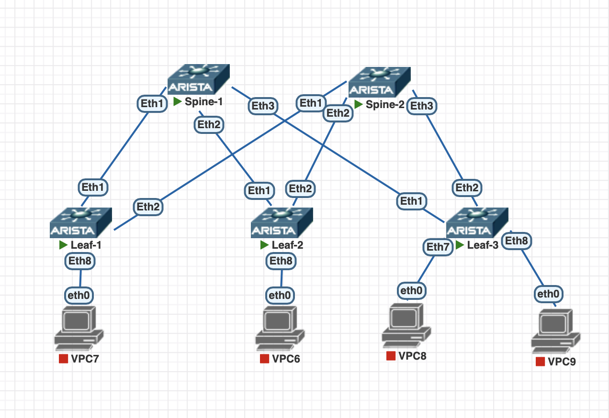

# Построение Underlay сети (ISIS)

## 1. Цель работы

Настроить динамическую маршрутизацию **IS-IS** в качестве Underlay-протокола для фабрики Leaf-Spine на оборудовании Arista EOS.

Топология состоит из:

- 2 Spine-коммутаторов;
- 3 Leaf-коммутаторов;
- двух физических подключений каждого Leaf к обоим Spine;
- Loopback0 на каждом устройстве.

В качестве Underlay используется IPv4.

Основные задачи:

1. Настроить IP-адресацию Loopback-интерфейсов.
2. Настроить `/31` сети на point-to-point соединениях Spine ↔ Leaf.
3. Включить IP routing.
4. Настроить IS-IS.
5. Перевести физические Spine ↔ Leaf соединения в режим IS-IS point-to-point.
6. Анонсировать Loopback0 через IS-IS.
7. Проверить формирование IS-IS соседств.
8. Проверить доступность Loopback-интерфейсов между всеми устройствами.

---

## 2. Адресное пространство

### Loopback адреса

Каждому устройству назначается уникальный `/32` адрес на интерфейсе `Loopback0`.

| Device | Interface | IP address |
|---|---|---|
| Spine-1 | Loopback0 | `10.255.0.1/32` |
| Spine-2 | Loopback0 | `10.255.0.2/32` |
| Leaf-1 | Loopback0 | `10.255.0.11/32` |
| Leaf-2 | Loopback0 | `10.255.0.12/32` |
| Leaf-3 | Loopback0 | `10.255.0.13/32` |

---

### Point-to-Point сети

Для соединений между Spine и Leaf используются сети `/31`.

Это позволяет использовать только два IP-адреса для каждого point-to-point соединения.

| Соединение | Network | Spine IP | Leaf IP |
|---|---|---|---|
| Spine-1 ↔ Leaf-1 | `10.0.1.0/31` | `10.0.1.0` | `10.0.1.1` |
| Spine-1 ↔ Leaf-2 | `10.0.1.2/31` | `10.0.1.2` | `10.0.1.3` |
| Spine-1 ↔ Leaf-3 | `10.0.1.4/31` | `10.0.1.4` | `10.0.1.5` |
| Spine-2 ↔ Leaf-1 | `10.0.2.0/31` | `10.0.2.0` | `10.0.2.1` |
| Spine-2 ↔ Leaf-2 | `10.0.2.2/31` | `10.0.2.2` | `10.0.2.3` |
| Spine-2 ↔ Leaf-3 | `10.0.2.4/31` | `10.0.2.4` | `10.0.2.5` |

---

## 3. Схема сети



---

## 4. IS-IS

Для Underlay используется IS-IS.

Имя IS-IS instance:

```text
UNDERLAY
```
Для всех устройств используется одна IS-IS Area:

```text
49.0001
```
---

**NET**

В отличие от OSPF, IS-IS не использует Router ID в качестве основного идентификатора IS-IS маршрутизатора.

Каждому маршрутизатору необходимо назначить уникальный **NET — Network Entity Title**.

Формат:

```text
49.0001.xxxx.xxxx.xxxx.00
```

Где:

```text
49
```

Private AFI.

```text
0001
```

IS-IS Area ID.

```text
xxxx.xxxx.xxxx
```

Уникальный System ID маршрутизатора.

```text
00
```

NSEL.

Используем следующие NET:

| Device | NET |
|---|---|
| Spine-1 | `49.0001.0000.0000.0001.00` |
| Spine-2 | `49.0001.0000.0000.0002.00` |
| Leaf-1 | `49.0001.0000.0000.0011.00` |
| Leaf-2 | `49.0001.0000.0000.0012.00` |
| Leaf-3 | `49.0001.0000.0000.0013.00` |

System ID соответствует номеру устройства:

```text
Spine-1 -> 0000.0000.0001
Spine-2 -> 0000.0000.0002

Leaf-1  -> 0000.0000.0011
Leaf-2  -> 0000.0000.0012
Leaf-3  -> 0000.0000.0013
```

---

**IS-IS Level**

На всех устройствах используется только:

```eos
is-type level-2
```
Это позволяет использовать фабрику как единый IS-IS backbone.

---

**IS-IS Point-to-Point**

Физические соединения Spine ↔ Leaf являются point-to-point.

На интерфейсах используется:

```eos
isis network point-to-point
```

Пример:

```eos
interface Ethernet1
   no switchport
   ip address 10.0.1.0/31
   isis enable UNDERLAY
   isis circuit-type level-2
   isis network point-to-point
```

---

**Loopback**

Loopback0 также необходимо добавить в IS-IS:

```eos
interface Loopback0
   ip address 10.255.0.1/32
   isis enable UNDERLAY
   isis passive
```

---

## 5. Конфигурация оборудования

<details>
<summary>Spine-1</summary>

```
Spine-1(config)#sh run
! Command: show running-config
! device: Spine-1 (vEOS-lab, EOS-4.33.1.1F)
!
! boot system flash:/vEOS-lab.swi
!
no aaa root
!
no service interface inactive port-id allocation disabled
!
transceiver qsfp default-mode 4x10G
!
service routing protocols model multi-agent
!
hostname Spine-1
!
spanning-tree mode mstp
!
system l1
   unsupported speed action error
   unsupported error-correction action error
!
interface Ethernet1
   no switchport
   ip address 10.0.1.0/31
   isis enable UNDERLAY
   isis circuit-type level-2
   isis network point-to-point
!
interface Ethernet2
   no switchport
   ip address 10.0.1.2/31
   isis enable UNDERLAY
   isis circuit-type level-2
   isis network point-to-point
!
interface Ethernet3
   no switchport
   ip address 10.0.1.4/31
   isis enable UNDERLAY
   isis circuit-type level-2
   isis network point-to-point
!
interface Ethernet4
!
interface Ethernet5
!
interface Ethernet6
!
interface Ethernet7
!
interface Ethernet8
!
interface Loopback0
   ip address 10.255.0.1/32
   isis enable UNDERLAY
   isis circuit-type level-2
!
interface Management1
!
ip routing
!
router isis UNDERLAY
   net 49.0001.0000.0000.0001.00
   is-type level-2
   !
   address-family ipv4 unicast
!
router multicast
   ipv4
      software-forwarding kernel
   !
   ipv6
      software-forwarding kernel
!
end
```

</details>

<details>
<summary>Spine-2</summary>

```
Spine-2(config)#sh run
! Command: show running-config
! device: Spine-2 (vEOS-lab, EOS-4.33.1.1F)
!
! boot system flash:/vEOS-lab.swi
!
no aaa root
!
no service interface inactive port-id allocation disabled
!
transceiver qsfp default-mode 4x10G
!
service routing protocols model multi-agent
!
hostname Spine-2
!
spanning-tree mode mstp
!
system l1
   unsupported speed action error
   unsupported error-correction action error
!
interface Ethernet1
   no switchport
   ip address 10.0.2.0/31
   isis enable UNDERLAY
   isis circuit-type level-2
   isis network point-to-point
!
interface Ethernet2
   no switchport
   ip address 10.0.2.2/31
   isis enable UNDERLAY
   isis circuit-type level-2
   isis network point-to-point
!
interface Ethernet3
   no switchport
   ip address 10.0.2.4/31
   isis enable UNDERLAY
   isis circuit-type level-2
   isis network point-to-point
!
interface Ethernet4
!
interface Ethernet5
!
interface Ethernet6
!
interface Ethernet7
!
interface Ethernet8
!
interface Loopback0
   ip address 10.255.0.2/32
   isis enable UNDERLAY
   isis circuit-type level-2
!
interface Management1
!
ip routing
!
router isis UNDERLAY
   net 49.0001.0000.0000.0002.00
   is-type level-2
   !
   address-family ipv4 unicast
!
router multicast
   ipv4
      software-forwarding kernel
   !
   ipv6
      software-forwarding kernel
!
end
```

</details>

<details>
<summary>Leaf-1</summary>

```
Leaf-1(config)#sh run
! Command: show running-config
! device: Leaf-1 (vEOS-lab, EOS-4.33.1.1F)
!
! boot system flash:/vEOS-lab.swi
!
no aaa root
!
no service interface inactive port-id allocation disabled
!
transceiver qsfp default-mode 4x10G
!
service routing protocols model multi-agent
!
hostname Leaf-1
!
spanning-tree mode mstp
!
system l1
   unsupported speed action error
   unsupported error-correction action error
!
interface Ethernet1
   no switchport
   ip address 10.0.1.1/31
   isis enable UNDERLAY
   isis circuit-type level-2
   isis network point-to-point
!
interface Ethernet2
   no switchport
   ip address 10.0.2.1/31
   isis enable UNDERLAY
   isis circuit-type level-2
   isis network point-to-point
!
interface Ethernet3
!
interface Ethernet4
!
interface Ethernet5
!
interface Ethernet6
!
interface Ethernet7
!
interface Ethernet8
!
interface Loopback0
   ip address 10.255.0.11/32
   isis enable UNDERLAY
   isis circuit-type level-2
!
interface Management1
!
ip routing
!
router isis UNDERLAY
   net 49.0001.0000.0000.0011.00
   is-type level-2
   !
   address-family ipv4 unicast
!
router multicast
   ipv4
      software-forwarding kernel
   !
   ipv6
      software-forwarding kernel
!
end
```

</details>

<details>
<summary>Leaf-2</summary>

```
Leaf-2(config)#sh run
! Command: show running-config
! device: Leaf-2 (vEOS-lab, EOS-4.33.1.1F)
!
! boot system flash:/vEOS-lab.swi
!
no aaa root
!
no service interface inactive port-id allocation disabled
!
transceiver qsfp default-mode 4x10G
!
service routing protocols model multi-agent
!
hostname Leaf-2
!
spanning-tree mode mstp
!
system l1
   unsupported speed action error
   unsupported error-correction action error
!
interface Ethernet1
   no switchport
   ip address 10.0.1.3/31
   isis enable UNDERLAY
   isis circuit-type level-2
   isis network point-to-point
!
interface Ethernet2
   no switchport
   ip address 10.0.2.3/31
   isis enable UNDERLAY
   isis circuit-type level-2
   isis network point-to-point
!
interface Ethernet3
!
interface Ethernet4
!
interface Ethernet5
!
interface Ethernet6
!
interface Ethernet7
!
interface Ethernet8
!
interface Loopback0
   ip address 10.255.0.12/32
   isis enable UNDERLAY
   isis circuit-type level-2
!
interface Management1
!
ip routing
!
router isis UNDERLAY
   net 49.0001.0000.0000.0012.00
   is-type level-2
   !
   address-family ipv4 unicast
!
router multicast
   ipv4
      software-forwarding kernel
   !
   ipv6
      software-forwarding kernel
!
end
```

</details>

<details>
<summary>Leaf-3</summary>

```
Leaf-3(config)#sh run
! Command: show running-config
 ! device: Leaf-3 (vEOS-lab, EOS-4.33.1.1F)
!
! boot system flash:/vEOS-lab.swi
!
no aaa root
!
no service interface inactive port-id allocation disabled
!
transceiver qsfp default-mode 4x10G
!
service routing protocols model multi-agent
!
hostname Leaf-3
!
spanning-tree mode mstp
!
system l1
   unsupported speed action error
   unsupported error-correction action error
!
interface Ethernet1
   description to Spine-1
   no switchport
   ip address 10.0.1.5/31
   isis enable UNDERLAY
   isis circuit-type level-2
   isis network point-to-point
!
interface Ethernet2
   no switchport
   ip address 10.0.2.5/31
   isis enable UNDERLAY
   isis circuit-type level-2
   isis network point-to-point
!
interface Ethernet3
!
interface Ethernet4
!
interface Ethernet5
!
interface Ethernet6
!
interface Ethernet7
!
interface Ethernet8
!
interface Loopback0
   ip address 10.255.0.13/32
   isis enable UNDERLAY
   isis circuit-type level-2
!
interface Management1
!
ip routing
!
router isis UNDERLAY
   net 49.0001.0000.0000.0013.00
   is-type level-2
   !
   address-family ipv4 unicast
!
router multicast
   ipv4
      software-forwarding kernel
   !
   ipv6
      software-forwarding kernel
!
end
```

</details>

---

## 5. Проверка IS-IS

### Проверка соседства

```eos
show isis neighbors
```

На каждом Spine должно быть три IS-IS соседа.

Например на Spine-1:

```text
Spine-1(config)#sh isis neighbors

Instance  VRF      System Id        Type Interface          SNPA              State Hold time   Circuit Id
UNDERLAY  default  Leaf-1           L2   Ethernet1          P2P               UP    28          14
UNDERLAY  default  Leaf-2           L2   Ethernet2          P2P               UP    21          17
UNDERLAY  default  Leaf-3           L2   Ethernet3          P2P               UP    22          15
```

На каждом Leaf должно быть два соседа:

```text
Leaf-1(config)#sh isis neighbors

Instance  VRF      System Id        Type Interface          SNPA              State Hold time   Circuit Id
UNDERLAY  default  Spine-1          L2   Ethernet1          P2P               UP    29          19
UNDERLAY  default  Spine-2          L2   Ethernet2          P2P               UP    29          15
```


---

### Проверка интерфейсов IS-IS

```eos
show isis interface
```


```text
Leaf-1(config)#show isis interface

IS-IS Instance: **UNDERLAY** VRF: default

  Interface Loopback0:
    Index: 11 SNPA: 0:0:0:0:0:0
    MTU: 65532 Type: loopback
    Supported address families: IPv4
    Area proxy boundary is disabled
    BFD IPv4 is disabled
    BFD IPv6 is disabled
    Hello padding is enabled
    **Level 2:**
      Metric: 10 (passive interface)
      Authentication mode: None
      TI-LFA protection is disabled for IPv4
      TI-LFA protection is disabled for IPv6
  Interface Ethernet1:
    Index: 20 SNPA: P2P
    MTU: 1497 Type: **point-to-point**
    Supported address families: IPv4
    Area proxy boundary is disabled
    Speed: 1000 mbps
    BFD IPv4 is disabled
    BFD IPv6 is disabled
    Hello padding is enabled
    **Level 2:**
      Metric: 10, Number of adjacencies: 1
      Link-ID: 14
      Authentication mode: None
      TI-LFA protection is disabled for IPv4
      TI-LFA protection is disabled for IPv6
  Interface Ethernet2:
    Index: 22 SNPA: P2P
    MTU: 1497 Type: **point-to-point**
    Supported address families: IPv4
    Area proxy boundary is disabled
    Speed: 1000 mbps
    BFD IPv4 is disabled
    BFD IPv6 is disabled
    Hello padding is enabled
    **Level 2:**
      Metric: 10, Number of adjacencies: 1
      Link-ID: 16
      Authentication mode: None
      TI-LFA protection is disabled for IPv4
      TI-LFA protection is disabled for IPv6
```


---

### Проверка Link State Database

```eos
show isis database
```

Подробный вывод:

```eos
show isis database detail
```

В Level-2 LSDB должны присутствовать все пять устройств:

```text
Spine-1(config)#show isis database
Legend:
H - hostname conflict
U - node unreachable

IS-IS Instance: UNDERLAY VRF: default
  IS-IS Level 2 Link State Database
    LSPID                   Seq Num  Cksum  Life Length IS  Received LSPID        Flags
    Spine-1.00-00                86  37516   751    147 L2  0000.0000.0001.00-00  <>
    Spine-2.00-00                20  59246   968    147 L2  0000.0000.0002.00-00  <>
    Leaf-1.00-00                 84  32919   415    122 L2  0000.0000.0011.00-00  <>
    Leaf-2.00-00                 17  16908  1020    122 L2  0000.0000.0012.00-00  <>
    Leaf-3.00-00                 16  30411   733    122 L2  0000.0000.0013.00-00  <>
```

---

### Проверка таблицы маршрутизации

```eos
show ip route
```


Например на Leaf-1 должны присутствовать маршруты к Loopback:

```text
Leaf-1(config)#show ip route

VRF: default
Source Codes:
       C - connected, S - static, K - kernel,
       O - OSPF, IA - OSPF inter area, E1 - OSPF external type 1,
       E2 - OSPF external type 2, N1 - OSPF NSSA external type 1,
       N2 - OSPF NSSA external type2, B - Other BGP Routes,
       B I - iBGP, B E - eBGP, R - RIP, I L1 - IS-IS level 1,
       I L2 - IS-IS level 2, O3 - OSPFv3, A B - BGP Aggregate,
       A O - OSPF Summary, NG - Nexthop Group Static Route,
       V - VXLAN Control Service, M - Martian,
       DH - DHCP client installed default route,
       DP - Dynamic Policy Route, L - VRF Leaked,
       G  - gRIBI, RC - Route Cache Route,
       CL - CBF Leaked Route

Gateway of last resort is not set

 C        10.0.1.0/31
           directly connected, Ethernet1
 I L2     10.0.1.2/31 [115/20]
           via 10.0.1.0, Ethernet1
 I L2     10.0.1.4/31 [115/20]
           via 10.0.1.0, Ethernet1
 C        10.0.2.0/31
           directly connected, Ethernet2
 I L2     10.0.2.2/31 [115/20]
           via 10.0.2.0, Ethernet2
 I L2     10.0.2.4/31 [115/20]
           via 10.0.2.0, Ethernet2
 I L2     10.255.0.1/32 [115/20]
           via 10.0.1.0, Ethernet1
 I L2     10.255.0.2/32 [115/20]
           via 10.0.2.0, Ethernet2
 C        10.255.0.11/32
           directly connected, Loopback0
 I L2     10.255.0.12/32 [115/30]
           via 10.0.1.0, Ethernet1
           via 10.0.2.0, Ethernet2
 I L2     10.255.0.13/32 [115/30]
           via 10.0.1.0, Ethernet1
           via 10.0.2.0, Ethernet2
```

---

### Проверка связности

Проверяем доступность Loopback-интерфейсов.

С Leaf-1:

```
Leaf-1(config)#ping 10.255.0.1
PING 10.255.0.1 (10.255.0.1) 72(100) bytes of data.
80 bytes from 10.255.0.1: icmp_seq=1 ttl=64 time=14.1 ms
80 bytes from 10.255.0.1: icmp_seq=2 ttl=64 time=5.09 ms
80 bytes from 10.255.0.1: icmp_seq=3 ttl=64 time=3.31 ms
80 bytes from 10.255.0.1: icmp_seq=4 ttl=64 time=2.61 ms
80 bytes from 10.255.0.1: icmp_seq=5 ttl=64 time=2.35 ms
```
```
Leaf-1(config)#ping 10.255.0.2
PING 10.255.0.2 (10.255.0.2) 72(100) bytes of data.
80 bytes from 10.255.0.2: icmp_seq=1 ttl=64 time=9.53 ms
80 bytes from 10.255.0.2: icmp_seq=2 ttl=64 time=3.49 ms
80 bytes from 10.255.0.2: icmp_seq=3 ttl=64 time=2.55 ms
80 bytes from 10.255.0.2: icmp_seq=4 ttl=64 time=2.44 ms
80 bytes from 10.255.0.2: icmp_seq=5 ttl=64 time=2.59 ms
```
```
Leaf-1(config)#ping 10.255.0.12
PING 10.255.0.12 (10.255.0.12) 72(100) bytes of data.
80 bytes from 10.255.0.12: icmp_seq=1 ttl=63 time=12.0 ms
80 bytes from 10.255.0.12: icmp_seq=2 ttl=63 time=4.98 ms
80 bytes from 10.255.0.12: icmp_seq=3 ttl=63 time=4.79 ms
80 bytes from 10.255.0.12: icmp_seq=4 ttl=63 time=5.51 ms
80 bytes from 10.255.0.12: icmp_seq=5 ttl=63 time=6.39 ms
```
```
Leaf-1(config)#ping 10.255.0.13
PING 10.255.0.13 (10.255.0.13) 72(100) bytes of data.
80 bytes from 10.255.0.13: icmp_seq=1 ttl=63 time=15.6 ms
80 bytes from 10.255.0.13: icmp_seq=2 ttl=63 time=9.98 ms
80 bytes from 10.255.0.13: icmp_seq=3 ttl=63 time=10.9 ms
80 bytes from 10.255.0.13: icmp_seq=4 ttl=63 time=8.22 ms
80 bytes from 10.255.0.13: icmp_seq=5 ttl=63 time=9.78 ms
```
---

## 5. BFD и аутентификация в ISIS

BFD (Bidirectional Forwarding Detection) с протоколом IS-IS нужна для одной главной цели — сверхбыстрого обнаружения падения линка или соседа (за доли секунды) и мгновенного запуска перерасчета маршрутов.

Аутентификация в  ISIS - нужна для защиты от злоумышленников и ошибок администрирования сети.

Конфигурация для BFD - добавляем на каждом интерфейсе ISIS:

```
interface Ethernet1
   bfd interval 300 min-rx 300 multiplier 5
   isis bfd
   
```
Интервал отправки в мс. С какой частотойкоммутатор будет отправлять свои BFD-пакеты соседу.
```
interval 300
```
Минимальный интервал приема. Какую максимальную скорость (частоту) приема пакетов от соседа готов поддерживать коммутатор
```
min-rx 300
```
Сколько BFD-пакетов подряд должен потерять коммутатор, чтобы официально объявить линк упавшим
```
multiplier 5
```
### Конфигурация устройств

<details>
<summary>Spine-1</summary>

```
 Spine-1(config)# sh run
! Command: show running-config
! device: Spine-1 (vEOS-lab, EOS-4.33.1.1F)
!
! boot system flash:/vEOS-lab.swi
!
no aaa root
!
no service interface inactive port-id allocation disabled
!
transceiver qsfp default-mode 4x10G
!
service routing protocols model multi-agent
!
hostname Spine-1
!
spanning-tree mode mstp
!
system l1
   unsupported speed action error
   unsupported error-correction action error
!
interface Ethernet1
   no switchport
   ip address 10.0.1.0/31
   bfd interval 300 min-rx 300 multiplier 5
   isis enable UNDERLAY
   isis bfd
   isis circuit-type level-2
   isis network point-to-point
   isis authentication mode md5
   isis authentication key 7 I8Im1UY+sDLCMvZLRWMfUg==
!
interface Ethernet2
   no switchport
   ip address 10.0.1.2/31
   bfd interval 300 min-rx 300 multiplier 5
   isis enable UNDERLAY
   isis bfd
   isis circuit-type level-2
   isis network point-to-point
   isis authentication mode md5
   isis authentication key 7 I8Im1UY+sDLCMvZLRWMfUg==
!
interface Ethernet3
   no switchport
   ip address 10.0.1.4/31
   bfd interval 300 min-rx 300 multiplier 5
   isis enable UNDERLAY
   isis bfd
   isis circuit-type level-2
   isis network point-to-point
   isis authentication mode md5
   isis authentication key 7 I8Im1UY+sDLCMvZLRWMfUg==
!
interface Ethernet4
!
interface Ethernet5
!
interface Ethernet6
!
interface Ethernet7
!
interface Ethernet8
!
interface Loopback0
   ip address 10.255.0.1/32
   isis enable UNDERLAY
   isis circuit-type level-2
!
interface Management1
!
ip routing
!
router isis UNDERLAY
   net 49.0001.0000.0000.0001.00
   is-type level-2
   authentication mode md5
   authentication key 7 I8Im1UY+sDLCMvZLRWMfUg==
   !
   address-family ipv4 unicast
!
router multicast
   ipv4
      software-forwarding kernel
   !
   ipv6
      software-forwarding kernel
!
end
```

</details>

<details>
<summary>Spine-2</summary>

```
Spine-2(config)#sh run
! Command: show running-config
! device: Spine-2 (vEOS-lab, EOS-4.33.1.1F)
!
! boot system flash:/vEOS-lab.swi
!
no aaa root
!
no service interface inactive port-id allocation disabled
!
transceiver qsfp default-mode 4x10G
!
service routing protocols model multi-agent
!
hostname Spine-2
!
spanning-tree mode mstp
!
system l1
   unsupported speed action error
   unsupported error-correction action error
!
interface Ethernet1
   no switchport
   ip address 10.0.2.0/31
   bfd interval 300 min-rx 300 multiplier 5
   isis enable UNDERLAY
   isis bfd
   isis circuit-type level-2
   isis network point-to-point
   isis authentication mode md5
   isis authentication key 7 I8Im1UY+sDLCMvZLRWMfUg==
!
interface Ethernet2
   no switchport
   ip address 10.0.2.2/31
   bfd interval 300 min-rx 300 multiplier 5
   isis enable UNDERLAY
   isis bfd
   isis circuit-type level-2
   isis network point-to-point
   isis authentication mode md5
   isis authentication key 7 I8Im1UY+sDLCMvZLRWMfUg==
!
interface Ethernet3
   no switchport
   ip address 10.0.2.4/31
   bfd interval 300 min-rx 300 multiplier 5
   isis enable UNDERLAY
   isis bfd
   isis circuit-type level-2
   isis network point-to-point
   isis authentication mode md5
   isis authentication key 7 I8Im1UY+sDLCMvZLRWMfUg==
!
interface Ethernet4
!
interface Ethernet5
!
interface Ethernet6
!
interface Ethernet7
!
interface Ethernet8
!
interface Loopback0
   ip address 10.255.0.2/32
   isis enable UNDERLAY
   isis circuit-type level-2
!
interface Management1
!
ip routing
!
router isis UNDERLAY
   net 49.0001.0000.0000.0002.00
   is-type level-2
   authentication mode md5
   authentication key 7 I8Im1UY+sDLCMvZLRWMfUg==
   !
   address-family ipv4 unicast
!
router multicast
   ipv4
      software-forwarding kernel
   !
   ipv6
      software-forwarding kernel
!
end
```

</details>

<details>
<summary>Leaf-1</summary>

```
Leaf-1(config)#sh run
! Command: show running-config
! device: Leaf-1 (vEOS-lab, EOS-4.33.1.1F)
!
! boot system flash:/vEOS-lab.swi
!
no aaa root
!
no service interface inactive port-id allocation disabled
!
transceiver qsfp default-mode 4x10G
!
service routing protocols model multi-agent
!
hostname Leaf-1
!
spanning-tree mode mstp
!
system l1
   unsupported speed action error
   unsupported error-correction action error
!
interface Ethernet1
   no switchport
   ip address 10.0.1.1/31
   bfd interval 300 min-rx 300 multiplier 5
   isis enable UNDERLAY
   isis bfd
   isis circuit-type level-2
   isis network point-to-point
   isis authentication mode md5
   isis authentication key 7 I8Im1UY+sDLCMvZLRWMfUg==
!
interface Ethernet2
   no switchport
   ip address 10.0.2.1/31
   bfd interval 300 min-rx 300 multiplier 5
   isis enable UNDERLAY
   isis bfd
   isis circuit-type level-2
   isis network point-to-point
   isis authentication mode md5
   isis authentication key 7 I8Im1UY+sDLCMvZLRWMfUg==
!
interface Ethernet3
   bfd interval 300 min-rx 300 multiplier 5
!
interface Ethernet4
!
interface Ethernet5
!
interface Ethernet6
!
interface Ethernet7
!
interface Ethernet8
!
interface Loopback0
   ip address 10.255.0.11/32
   isis enable UNDERLAY
   isis circuit-type level-2
!
interface Management1
!
ip routing
!
router isis UNDERLAY
   net 49.0001.0000.0000.0011.00
   is-type level-2
   authentication mode md5
   authentication key 7 I8Im1UY+sDLCMvZLRWMfUg==
   !
   address-family ipv4 unicast
!
router multicast
   ipv4
      software-forwarding kernel
   !
   ipv6
      software-forwarding kernel
!
end
```

</details>

<details>
<summary>Leaf-2</summary>

```
Leaf-2(config)#sh run
! Command: show running-config
! device: Leaf-2 (vEOS-lab, EOS-4.33.1.1F)
!
! boot system flash:/vEOS-lab.swi
!
no aaa root
!
no service interface inactive port-id allocation disabled
!
transceiver qsfp default-mode 4x10G
!
service routing protocols model multi-agent
!
hostname Leaf-2
!
spanning-tree mode mstp
!
system l1
   unsupported speed action error
   unsupported error-correction action error
!
interface Ethernet1
   no switchport
   ip address 10.0.1.3/31
   bfd interval 300 min-rx 300 multiplier 5
   isis enable UNDERLAY
   isis bfd
   isis circuit-type level-2
   isis network point-to-point
   isis authentication mode md5
   isis authentication key 7 I8Im1UY+sDLCMvZLRWMfUg==
!
interface Ethernet2
   no switchport
   ip address 10.0.2.3/31
   bfd interval 300 min-rx 300 multiplier 5
   isis enable UNDERLAY
   isis bfd
   isis circuit-type level-2
   isis network point-to-point
   isis authentication mode md5
   isis authentication key 7 I8Im1UY+sDLCMvZLRWMfUg==
!
interface Ethernet3
!
interface Ethernet4
!
interface Ethernet5
!
interface Ethernet6
!
interface Ethernet7
!
interface Ethernet8
!
interface Loopback0
   ip address 10.255.0.12/32
   isis enable UNDERLAY
   isis circuit-type level-2
!
interface Management1
!
ip routing
!
router isis UNDERLAY
   net 49.0001.0000.0000.0012.00
   is-type level-2
   authentication mode md5
   authentication key 7 I8Im1UY+sDLCMvZLRWMfUg==
   !
   address-family ipv4 unicast
!
router multicast
   ipv4
      software-forwarding kernel
   !
   ipv6
      software-forwarding kernel
!
end
```

</details>

<details>
<summary>Leaf-3</summary>

```
Leaf-3(config)#sh run
! Command: show running-config
 ! device: Leaf-3 (vEOS-lab, EOS-4.33.1.1F)
!
! boot system flash:/vEOS-lab.swi
!
no aaa root
!
no service interface inactive port-id allocation disabled
!
transceiver qsfp default-mode 4x10G
!
service routing protocols model multi-agent
!
hostname Leaf-3
!
spanning-tree mode mstp
!
system l1
   unsupported speed action error
   unsupported error-correction action error
!
interface Ethernet1
   description to Spine-1
   no switchport
   ip address 10.0.1.5/31
   bfd interval 300 min-rx 300 multiplier 5
   isis enable UNDERLAY
   isis bfd
   isis circuit-type level-2
   isis network point-to-point
   isis authentication mode md5
   isis authentication key 7 I8Im1UY+sDLCMvZLRWMfUg==
!
interface Ethernet2
   no switchport
   ip address 10.0.2.5/31
   bfd interval 300 min-rx 300 multiplier 5
   isis enable UNDERLAY
   isis bfd
   isis circuit-type level-2
   isis network point-to-point
   isis authentication mode md5
   isis authentication key 7 I8Im1UY+sDLCMvZLRWMfUg==
!
interface Ethernet3
!
interface Ethernet4
!
interface Ethernet5
!
interface Ethernet6
!
interface Ethernet7
!
interface Ethernet8
!
interface Loopback0
   ip address 10.255.0.13/32
   isis enable UNDERLAY
   isis circuit-type level-2
!
interface Management1
!
ip routing
!
router isis UNDERLAY
   net 49.0001.0000.0000.0013.00
   is-type level-2
   authentication mode md5
   authentication key 7 I8Im1UY+sDLCMvZLRWMfUg==
   !
   address-family ipv4 unicast
!
router multicast
   ipv4
      software-forwarding kernel
   !
   ipv6
      software-forwarding kernel
!
end
```

</details>
