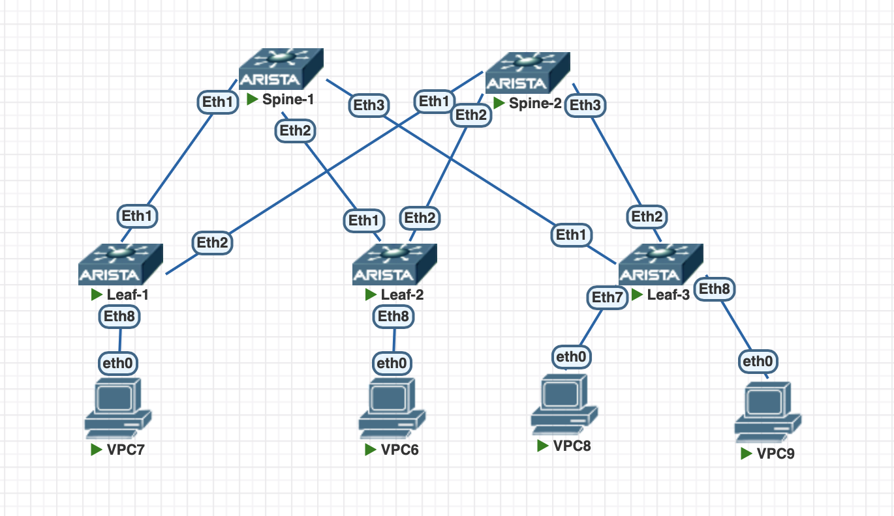

# VxLAN. EVPN L2

## 1. Цель работы

Цель работы — настроить VXLAN EVPN Overlay поверх ранее настроенного eBGP Underlay в Leaf-Spine фабрике.
На данном этапе реализуется только Layer 2 EVPN:
- L2-связность между клиентами, подключёнными к разным Leaf;
- VXLAN между Leaf-коммутаторами;
- MP-BGP EVPN в качестве Control Plane;
- распространение MAC-адресов через EVPN;
- автоматическое обнаружение удалённых VTEP;
- Ingress Replication для BUM-трафика.

---

## 2. Адресное пространство

### Loopback адреса

Каждому устройству назначается уникальный `/32` адрес на интерфейсе `Loopback0`. Так же назначаем номер автономной системы ASN.

| Device | Interface | IP address | ASN |
|---|---|---|---|
| Spine-1 | Loopback0 | `10.255.0.1/32` | ASN 65000 |
| Spine-2 | Loopback0 | `10.255.0.2/32` | ASN 65000 |
| Leaf-1 | Loopback0 | `10.255.0.11/32` | ASN 65101 |
| Leaf-2 | Loopback0 | `10.255.0.12/32` | ASN 65102 |
| Leaf-3 | Loopback0 | `10.255.0.13/32` | ASN 65103 |

---

### Point-to-Point сети

Для соединений между Spine и Leaf используются сети `/31`.

Это позволяет использовать только два IP-адреса для каждого point-to-point соединения.

| Соединение | Network | Spine IP | Leaf IP |
|---|---|---|---|
| Spine-1 ↔ Leaf-1 | `10.0.1.0/31` | `10.0.1.0` | `10.0.1.1` |
| Spine-1 ↔ Leaf-2 | `10.0.1.2/31` | `10.0.1.2` | `10.0.1.3` |
| Spine-1 ↔ Leaf-3 | `10.0.1.4/31` | `10.0.1.4` | `10.0.1.5` |
| Spine-2 ↔ Leaf-1 | `10.0.2.0/31` | `10.0.2.0` | `10.0.2.1` |
| Spine-2 ↔ Leaf-2 | `10.0.2.2/31` | `10.0.2.2` | `10.0.2.3` |
| Spine-2 ↔ Leaf-3 | `10.0.2.4/31` | `10.0.2.4` | `10.0.2.5` |

---

## 3. Архитектура
Фабрика состоит из двух логических уровней:

```
UNDERLAY
   
   - eBGP IPv4
   - IP transport
   - ECMP
   - доставка пакетов между VTEP

OVERLAY
   
   - MP-BGP EVPN Control Plane
   - VXLAN Data Plane
```

## 4. Схема сети



---

## 5. Настройка VxLAN. EVPN L2

###  1. Проверка Underlay

Перед настройкой VXLAN необходимо убедиться, что базовая IP-фабрика полностью работоспособна.
Проверяем:
- eBGP-соседства между Leaf и Spine;
- маршруты до Loopback0 всех устройств;
- ECMP через оба Spine;
- доступность VTEP-адресов между Leaf;
- MTU на Underlay-интерфейсах.

###  2. Проверка Multi-Agent Routing

Для работы EVPN на Arista EOS необходимо использовать:

```
service routing protocols model multi-agent
```

Проверяем наличие этой настройки на всех Leaf и Spine.

###  3. Создание клиентского VLAN

Создаём клиентский VLAN:
```
VLAN 10
```

### 4. Назначение VNI

Каждому VLAN назначается VXLAN Network Identifier.
Для VLAN 10 используется:
```
VNI 10010
```
VNI идентифицирует L2 broadcast domain внутри VXLAN Overlay.

### 5. Создание VTEP

На каждом Leaf создаётся VXLAN Tunnel Endpoint.
В качестве VTEP используется Loopback0:

LEAF-1 -> 10.255.0.11
LEAF-2 -> 10.255.0.12
LEAF-3 -> 10.255.0.13

Spine VTEP не являются.

### 6. Настройка VXLAN интерфейса

На каждом Leaf создаётся логический интерфейс:
Vxlan1
В нём указываются:
```
source-interface Loopback0;
UDP port 4789;
соответствие VLAN и VNI.
```
### 7. Настройка EVPN BGP Overlay
Между Loopback0 Leaf и Spine создаются отдельные BGP-сессии для EVPN.

### 8. Настройка RD и RT
Для каждого L2 VNI задаются:
RD
RT
RD должен быть уникальным.

Используем:
```
Leaf-1:
10.255.0.11:10010

Leaf-2:
10.255.0.12:10010

Leaf-3:
10.255.0.13:10010
```
RT одинаковый для всех Leaf одного L2-сервиса:
```
65000:10010
```

### 9. Включение распространения MAC

На Leaf включается экспорт динамически изученных MAC-адресов в EVPN.
После этого локально изученный MAC может быть передан другим Leaf через MP-BGP EVPN.

### 10. Проверка EVPN Type-3

После поднятия EVPN каждый VTEP должен сообщить об участии в VNI 10010.
Проверяем EVPN Type-3 IMET.
В результате каждый Leaf должен узнать остальные VTEP:
```
LEAF-1 знает:
10.255.0.12
10.255.0.13

LEAF-2 знает:
10.255.0.11
10.255.0.13

LEAF-3 знает:
10.255.0.11
10.255.0.12
```

### 11. Проверка Data Plane
После изучения MAC проверяем, что есть связность между клиентами

## 6. Конфигурация оборудования

<details>
<summary>Spine-1</summary>

```
Spine-1# sh run
! Command: show running-config
! device: Spine-1 (vEOS-lab, EOS-4.33.1.1F)
!
! boot system flash:/vEOS-lab.swi
!
no aaa root
!
no service interface inactive port-id allocation disabled
!
transceiver qsfp default-mode 4x10G
!
service routing protocols model multi-agent
!
hostname Spine-1
!
spanning-tree mode mstp
!
system l1
   unsupported speed action error
   unsupported error-correction action error
!
interface Ethernet1
   mtu 9000
   no switchport
   ip address 10.0.1.0/31   
!
interface Ethernet2
   mtu 9000
   no switchport
   ip address 10.0.1.2/31
!
interface Ethernet3
   mtu 9000
   no switchport
   ip address 10.0.1.4/31
!
interface Ethernet4
!
interface Ethernet5
!
interface Ethernet6
!
interface Ethernet7
!
interface Ethernet8
!
interface Loopback0
   ip address 10.255.0.1/32
!
interface Management1
!
ip routing
!
router bgp 65000
   router-id 10.255.0.1
   timers bgp 3 9
   maximum-paths 2
   neighbor EVPN peer group
   neighbor EVPN next-hop-unchanged
   neighbor EVPN update-source Loopback0
   neighbor EVPN ebgp-multihop 3
   neighbor EVPN send-community extended
   neighbor 10.0.1.1 remote-as 65101
   neighbor 10.0.1.1 bfd
   neighbor 10.0.1.1 description Leaf-1
   neighbor 10.0.1.3 remote-as 65102
   neighbor 10.0.1.3 bfd
   neighbor 10.0.1.3 description Leaf-2
   neighbor 10.0.1.5 remote-as 65103
   neighbor 10.0.1.5 bfd
   neighbor 10.0.1.5 description Leaf-3
   neighbor 10.255.0.11 peer group EVPN
   neighbor 10.255.0.11 remote-as 65101
   neighbor 10.255.0.12 peer group EVPN
   neighbor 10.255.0.12 remote-as 65102
   neighbor 10.255.0.13 peer group EVPN
   neighbor 10.255.0.13 remote-as 65103
   !
   address-family evpn
      neighbor EVPN activate
   !
   address-family ipv4
      no neighbor EVPN activate
      network 10.255.0.1/32
!
router multicast
   ipv4
      software-forwarding kernel
   !
   ipv6
      software-forwarding kernel
!
end
```

</details>

<details>
<summary>Spine-2</summary>

```
Spine-2#sh run
! Command: show running-config
! device: Spine-2 (vEOS-lab, EOS-4.33.1.1F)
!
! boot system flash:/vEOS-lab.swi
!
no aaa root
!
no service interface inactive port-id allocation disabled
!
transceiver qsfp default-mode 4x10G
!
service routing protocols model multi-agent
!
hostname Spine-2
!
spanning-tree mode mstp
!
system l1
   unsupported speed action error
   unsupported error-correction action error
!
interface Ethernet1
   mtu 9000
   no switchport
   ip address 10.0.2.0/31
!
interface Ethernet2
   mtu 9000
   no switchport
   ip address 10.0.2.2/31
!
interface Ethernet3
   mtu 9000
   no switchport
   ip address 10.0.2.4/31
!
interface Ethernet4
!
interface Ethernet5
!
interface Ethernet6
!
interface Ethernet7
!
interface Ethernet8
!
interface Loopback0
   ip address 10.255.0.2/32
!
interface Management1
!
ip routing
!
router bgp 65000
   router-id 10.255.0.2
   timers bgp 3 9
   maximum-paths 2
   neighbor EVPN peer group
   neighbor EVPN next-hop-unchanged
   neighbor EVPN update-source Loopback0
   neighbor EVPN ebgp-multihop 3
   neighbor EVPN send-community extended
   neighbor 10.0.2.1 remote-as 65101
   neighbor 10.0.2.1 bfd
   neighbor 10.0.2.1 description Leaf-1
   neighbor 10.0.2.3 remote-as 65102
   neighbor 10.0.2.3 bfd
   neighbor 10.0.2.3 description Leaf-2
   neighbor 10.0.2.5 remote-as 65103
   neighbor 10.0.2.5 bfd
   neighbor 10.0.2.5 description Leaf-3
   neighbor 10.255.0.11 peer group EVPN
   neighbor 10.255.0.11 remote-as 65101
   neighbor 10.255.0.12 peer group EVPN
   neighbor 10.255.0.12 remote-as 65102
   neighbor 10.255.0.13 peer group EVPN
   neighbor 10.255.0.13 remote-as 65103
   !
   address-family evpn
      neighbor EVPN activate
   !
   address-family ipv4
      no neighbor EVPN activate
      network 10.255.0.2/32
!
router multicast
   ipv4
      software-forwarding kernel
   !
   ipv6
      software-forwarding kernel
!
end
```
</details>

<details>
<summary>Leaf-1</summary>

```
Leaf-1#sh run
! Command: show running-config
! device: Leaf-1 (vEOS-lab, EOS-4.33.1.1F)
!
! boot system flash:/vEOS-lab.swi
!
no aaa root
!
no service interface inactive port-id allocation disabled
!
transceiver qsfp default-mode 4x10G
!
service routing protocols model multi-agent
!
hostname Leaf-1
!
spanning-tree mode mstp
!
system l1
   unsupported speed action error
   unsupported error-correction action error
!
vlan 10
   name vxlan10010
!
interface Ethernet1
   mtu 9000
   no switchport
   ip address 10.0.1.1/31
!
interface Ethernet2
   mtu 9000
   no switchport
   ip address 10.0.2.1/31
!
interface Ethernet3
!
interface Ethernet4
!
interface Ethernet5
!
interface Ethernet6
!
interface Ethernet7
!
interface Ethernet8
   switchport access vlan 10
!
interface Loopback0
   ip address 10.255.0.11/32
!
interface Management1
!
interface Vxlan1
   vxlan source-interface Loopback0
   vxlan udp-port 4789
   vxlan vlan 10 vni 10010
!
ip routing
!
router bgp 65101
   router-id 10.255.0.11
   timers bgp 3 9
   maximum-paths 2
   neighbor SPINE_EVPN peer group
   neighbor SPINE_EVPN remote-as 65000
   neighbor SPINE_EVPN update-source Loopback0
   neighbor SPINE_EVPN ebgp-multihop 3
   neighbor SPINE_EVPN send-community extended
   neighbor 10.0.1.0 remote-as 65000
   neighbor 10.0.1.0 bfd
   neighbor 10.0.1.0 description Spine-1
   neighbor 10.0.2.0 remote-as 65000
   neighbor 10.0.2.0 bfd
   neighbor 10.0.2.0 description Spine-2
   neighbor 10.255.0.1 peer group SPINE_EVPN
   neighbor 10.255.0.2 peer group SPINE_EVPN
   !
   vlan 10
      rd 10.255.0.11:10010
      route-target both 65000:10010
      redistribute learned
   !
   address-family evpn
      neighbor SPINE_EVPN activate
   !
   address-family ipv4
      no neighbor SPINE_EVPN activate
      network 10.255.0.11/32
!
router multicast
   ipv4
      software-forwarding kernel
   !
   ipv6
      software-forwarding kernel
!
end

```
</details>

<details>
<summary>Leaf-2</summary>

```
Leaf-2#sh run
! Command: show running-config
 ! device: Leaf-2 (vEOS-lab, EOS-4.33.1.1F)
!
! boot system flash:/vEOS-lab.swi
!
no aaa root
!
no service interface inactive port-id allocation disabled
!
transceiver qsfp default-mode 4x10G
!
service routing protocols model multi-agent
!
hostname Leaf-2
!
spanning-tree mode mstp
!
system l1
   unsupported speed action error
   unsupported error-correction action error
!
vlan 10
   name vxlan10010
!
interface Ethernet1
   mtu 9000
   no switchport
   ip address 10.0.1.3/31
!
interface Ethernet2
   mtu 9000
   no switchport
   ip address 10.0.2.3/31
!
interface Ethernet3
   no switchport
!
interface Ethernet4
!
interface Ethernet5
!
interface Ethernet6
!
interface Ethernet7
!
interface Ethernet8
   switchport access vlan 10
!
interface Loopback0
   ip address 10.255.0.12/32
!
interface Management1
!
interface Vxlan1
   vxlan source-interface Loopback0
   vxlan udp-port 4789
   vxlan vlan 10 vni 10010
!
ip routing
!
router bgp 65102
   router-id 10.255.0.12
   timers bgp 3 9
   maximum-paths 2
   neighbor SPINE_EVPN peer group
   neighbor SPINE_EVPN remote-as 65000
   neighbor SPINE_EVPN update-source Loopback0
   neighbor SPINE_EVPN ebgp-multihop 3
   neighbor SPINE_EVPN send-community extended
   neighbor 10.0.1.2 remote-as 65000
   neighbor 10.0.1.2 bfd
   neighbor 10.0.1.2 description Spine-1
   neighbor 10.0.2.2 remote-as 65000
   neighbor 10.0.2.2 bfd
   neighbor 10.0.2.2 description Spine-2
   neighbor 10.255.0.1 peer group SPINE_EVPN
   neighbor 10.255.0.2 peer group SPINE_EVPN
   !
   vlan 10
      rd 10.255.0.12:10010
      route-target both 65000:10010
      redistribute learned
   !
   address-family evpn
      neighbor SPINE_EVPN activate
   !
   address-family ipv4
      no neighbor SPINE_EVPN activate
      network 10.255.0.12/32
!
router multicast
   ipv4
      software-forwarding kernel
   !
   ipv6
      software-forwarding kernel
!
end

```
</details>

<details>
<summary>Leaf-3</summary>

```
Leaf-3#sh run
! Command: show running-config
! device: Leaf-3 (vEOS-lab, EOS-4.33.1.1F)
!
! boot system flash:/vEOS-lab.swi
!
no aaa root
!
no service interface inactive port-id allocation disabled
!
transceiver qsfp default-mode 4x10G
!
service routing protocols model multi-agent
!
hostname Leaf-3
!
spanning-tree mode mstp
!
system l1
   unsupported speed action error
   unsupported error-correction action error
!
vlan 10
   name vxlan10010
!
interface Ethernet1
   mtu 9000
   no switchport
   ip address 10.0.1.5/31
!
interface Ethernet2
   mtu 9000
   no switchport
   ip address 10.0.2.5/31
!
interface Ethernet3
!
interface Ethernet4
!
interface Ethernet5
!
interface Ethernet6
!
interface Ethernet7
   switchport access vlan 10
!
interface Ethernet8
   switchport access vlan 10
!
interface Loopback0
   ip address 10.255.0.13/32
!
interface Management1
!
interface Vxlan1
   vxlan source-interface Loopback0
   vxlan udp-port 4789
   vxlan vlan 10 vni 10010
!
ip routing
!
router bgp 65103
   router-id 10.255.0.13
   timers bgp 3 9
   maximum-paths 2
   neighbor SPINE_EVPN peer group
   neighbor SPINE_EVPN remote-as 65000
   neighbor SPINE_EVPN update-source Loopback0
   neighbor SPINE_EVPN ebgp-multihop 3
   neighbor SPINE_EVPN send-community extended
   neighbor 10.0.1.4 remote-as 65000
   neighbor 10.0.1.4 bfd
   neighbor 10.0.1.4 description Spine-1
   neighbor 10.0.2.4 remote-as 65000
   neighbor 10.0.2.4 bfd
   neighbor 10.0.2.4 description Spine-2
   neighbor 10.255.0.1 peer group SPINE_EVPN
   neighbor 10.255.0.2 peer group SPINE_EVPN
   !
   vlan 10
      rd 10.255.0.13:10010
      route-target both 65000:10010
      redistribute learned
   !
   address-family evpn
      neighbor SPINE_EVPN activate
   !
   address-family ipv4
      no neighbor SPINE_EVPN activate
      network 10.255.0.13/32
!
router multicast
   ipv4
      software-forwarding kernel
   !
   ipv6
      software-forwarding kernel
!
end

```
</details>

## 7. Проверка

```
Leaf-1#show bgp summary
BGP summary information for VRF default
Router identifier 10.255.0.11, local AS number 65101
Neighbor            AS Session State AFI/SAFI                AFI/SAFI State   NLRI Rcd   NLRI Acc
---------- ----------- ------------- ----------------------- -------------- ---------- ----------
10.0.1.0         65000 Established   IPv4 Unicast            Negotiated              3          3
10.0.2.0         65000 Established   IPv4 Unicast            Negotiated              3          3
10.255.0.1       65000 Established   L2VPN EVPN              Negotiated              3          3
10.255.0.2       65000 Established   L2VPN EVPN              Negotiated              3          3
```
```
Leaf-2#sh bgp summary
BGP summary information for VRF default
Router identifier 10.255.0.12, local AS number 65102
Neighbor            AS Session State AFI/SAFI                AFI/SAFI State   NLRI Rcd   NLRI Acc
---------- ----------- ------------- ----------------------- -------------- ---------- ----------
10.0.1.2         65000 Established   IPv4 Unicast            Negotiated              3          3
10.0.2.2         65000 Established   IPv4 Unicast            Negotiated              3          3
10.255.0.1       65000 Established   L2VPN EVPN              Negotiated              2          2
10.255.0.2       65000 Established   L2VPN EVPN              Negotiated              2          2
```
```
Leaf-3#sh bgp summary
BGP summary information for VRF default
Router identifier 10.255.0.13, local AS number 65103
Neighbor            AS Session State AFI/SAFI                AFI/SAFI State   NLRI Rcd   NLRI Acc
---------- ----------- ------------- ----------------------- -------------- ---------- ----------
10.0.1.4         65000 Established   IPv4 Unicast            Negotiated              3          3
10.0.2.4         65000 Established   IPv4 Unicast            Negotiated              3          3
10.255.0.1       65000 Established   L2VPN EVPN              Negotiated              2          2
10.255.0.2       65000 Established   L2VPN EVPN              Negotiated              2          2
```

Проверяем связность VTEP-VTEP

```
Leaf-1#ping 10.255.0.12 source 10.255.0.11
PING 10.255.0.12 (10.255.0.12) from 10.255.0.11 : 72(100) bytes of data.
80 bytes from 10.255.0.12: icmp_seq=1 ttl=63 time=6.97 ms
80 bytes from 10.255.0.12: icmp_seq=2 ttl=63 time=4.31 ms
80 bytes from 10.255.0.12: icmp_seq=3 ttl=63 time=3.45 ms
80 bytes from 10.255.0.12: icmp_seq=4 ttl=63 time=3.08 ms
80 bytes from 10.255.0.12: icmp_seq=5 ttl=63 time=3.17 ms

--- 10.255.0.12 ping statistics ---
5 packets transmitted, 5 received, 0% packet loss, time 26ms
rtt min/avg/max/mdev = 3.075/4.194/6.971/1.454 ms, ipg/ewma 6.536/5.509 ms
```
```
Leaf-1#ping 10.255.0.13 source 10.255.0.11
PING 10.255.0.13 (10.255.0.13) from 10.255.0.11 : 72(100) bytes of data.
80 bytes from 10.255.0.13: icmp_seq=1 ttl=63 time=7.16 ms
80 bytes from 10.255.0.13: icmp_seq=2 ttl=63 time=4.39 ms
80 bytes from 10.255.0.13: icmp_seq=3 ttl=63 time=2.66 ms
80 bytes from 10.255.0.13: icmp_seq=4 ttl=63 time=2.89 ms
80 bytes from 10.255.0.13: icmp_seq=5 ttl=63 time=2.82 ms

--- 10.255.0.13 ping statistics ---
5 packets transmitted, 5 received, 0% packet loss, time 26ms
rtt min/avg/max/mdev = 2.659/3.983/7.160/1.706 ms, ipg/ewma 6.598/5.487 ms
```
Проверка EVPN BGP соседств

```
Spine-1#show bgp evpn summary
BGP summary information for VRF default
Router identifier 10.255.0.1, local AS number 65000
Neighbor Status Codes: m - Under maintenance
  Description              Neighbor    V AS           MsgRcvd   MsgSent  InQ OutQ  Up/Down State   PfxRcd PfxAcc
                           10.255.0.11 4 65101           8113      8129    0    0 05:43:44 Estab   2      2
                           10.255.0.12 4 65102           7920      7935    0    0 04:31:19 Estab   1      1
                           10.255.0.13 4 65103           8347      8349    0    0 05:53:41 Estab   2      2
```
```
Spine-2(config)#sh bgp evpn summary
BGP summary information for VRF default
Router identifier 10.255.0.2, local AS number 65000
Neighbor Status Codes: m - Under maintenance
  Description              Neighbor    V AS           MsgRcvd   MsgSent  InQ OutQ  Up/Down State   PfxRcd PfxAcc
                           10.255.0.11 4 65101           3885      3885    0    0 02:45:02 Estab   1      1
                           10.255.0.12 4 65102           3894      3883    0    0 02:45:02 Estab   1      1
                           10.255.0.13 4 65103           3891      3888    0    0 02:45:02 Estab   1      1
```

Проверка всех EVPN маршрутов

```
Leaf-1#show bgp evpn
BGP routing table information for VRF default
Router identifier 10.255.0.11, local AS number 65101
Route status codes: * - valid, > - active, S - Stale, E - ECMP head, e - ECMP
                    c - Contributing to ECMP, % - Pending best path selection
Origin codes: i - IGP, e - EGP, ? - incomplete
AS Path Attributes: Or-ID - Originator ID, C-LST - Cluster List, LL Nexthop - Link Local Nexthop

          Network                Next Hop              Metric  LocPref Weight  Path
 * >      RD: 10.255.0.11:10010 imet 10.255.0.11
                                 -                     -       -       0       i
 * >Ec    RD: 10.255.0.11:10010 imet 10.255.0.12
                                 10.255.0.12           -       100     0       65000 65102 i
 *  ec    RD: 10.255.0.11:10010 imet 10.255.0.12
                                 10.255.0.12           -       100     0       65000 65102 i
 * >Ec    RD: 10.255.0.11:10010 imet 10.255.0.13
                                 10.255.0.13           -       100     0       65000 65103 i
 *  ec    RD: 10.255.0.11:10010 imet 10.255.0.13
                                 10.255.0.13           -       100     0       65000 65103 i
```

Проверка удаленных VTEP

```
Leaf-2#show vxlan vtep
Remote VTEPS for Vxlan1:

VTEP              Tunnel Type(s)
----------------- --------------
10.255.0.11       unicast, flood
10.255.0.13       unicast, flood

Total number of remote VTEPS:  2
```

На клиентах зададим адреса:
```
- VPC7 - 172.16.10.1
- VPC6 - 172.16.10.2
- VPC8 - 172.16.10.3
- VPC9 - 172.16.10.4
```

Проверяем с VPC7 

```
VPCS> ping 172.16.10.2

84 bytes from 172.16.10.2 icmp_seq=1 ttl=64 time=8.965 ms
84 bytes from 172.16.10.2 icmp_seq=2 ttl=64 time=6.742 ms
84 bytes from 172.16.10.2 icmp_seq=3 ttl=64 time=6.093 ms
84 bytes from 172.16.10.2 icmp_seq=4 ttl=64 time=6.337 ms
84 bytes from 172.16.10.2 icmp_seq=5 ttl=64 time=5.706 ms
```
```
VPCS> ping 172.16.10.3

84 bytes from 172.16.10.3 icmp_seq=1 ttl=64 time=11.739 ms
84 bytes from 172.16.10.3 icmp_seq=2 ttl=64 time=6.698 ms
84 bytes from 172.16.10.3 icmp_seq=3 ttl=64 time=6.547 ms
84 bytes from 172.16.10.3 icmp_seq=4 ttl=64 time=8.327 ms
84 bytes from 172.16.10.3 icmp_seq=5 ttl=64 time=6.420 ms
```
```
VPCS> ping 172.16.10.4

84 bytes from 172.16.10.4 icmp_seq=1 ttl=64 time=12.919 ms
84 bytes from 172.16.10.4 icmp_seq=2 ttl=64 time=5.924 ms
84 bytes from 172.16.10.4 icmp_seq=3 ttl=64 time=6.533 ms
84 bytes from 172.16.10.4 icmp_seq=4 ttl=64 time=7.249 ms
84 bytes from 172.16.10.4 icmp_seq=5 ttl=64 time=6.585 ms
```
**show bgp evpn route-type mac-ip**
```
Leaf-1#show bgp evpn route-type mac-ip
BGP routing table information for VRF default
Router identifier 10.255.0.11, local AS number 65101
Route status codes: * - valid, > - active, S - Stale, E - ECMP head, e - ECMP
                    c - Contributing to ECMP, % - Pending best path selection
Origin codes: i - IGP, e - EGP, ? - incomplete
AS Path Attributes: Or-ID - Originator ID, C-LST - Cluster List, LL Nexthop - Link Local Nexthop

          Network                Next Hop              Metric  LocPref Weight  Path
 * >Ec    RD: 10.255.0.12:10010 mac-ip 0050.7966.6818
                                 10.255.0.12           -       100     0       65000 65102 i
 *  ec    RD: 10.255.0.12:10010 mac-ip 0050.7966.6818
                                 10.255.0.12           -       100     0       65000 65102 i
 * >      RD: 10.255.0.11:10010 mac-ip 0050.7966.6819
                                 -                     -       -       0       i
 * >Ec    RD: 10.255.0.13:10010 mac-ip 0050.7966.681a
                                 10.255.0.13           -       100     0       65000 65103 i
 *  ec    RD: 10.255.0.13:10010 mac-ip 0050.7966.681a
                                 10.255.0.13           -       100     0       65000 65103 i
 * >Ec    RD: 10.255.0.13:10010 mac-ip 0050.7966.681b
                                 10.255.0.13           -       100     0       65000 65103 i
 *  ec    RD: 10.255.0.13:10010 mac-ip 0050.7966.681b
                                 10.255.0.13           -       100     0       65000 65103 i
```
**show vxlan address-table**
```
Leaf-1#show vxlan address-table
          Vxlan Mac Address Table
----------------------------------------------------------------------

VLAN  Mac Address     Type      Prt  VTEP             Moves   Last Move
----  -----------     ----      ---  ----             -----   ---------
  10  0050.7966.6818  EVPN      Vx1  10.255.0.12      1       0:04:28 ago
  10  0050.7966.681a  EVPN      Vx1  10.255.0.13      1       0:00:59 ago
  10  0050.7966.681b  EVPN      Vx1  10.255.0.13      1       0:04:47 ago
Total Remote Mac Addresses for this criterion: 3

```
show mac address-table vlan 10
```
Leaf-1#show mac address-table vlan 10
          Mac Address Table
------------------------------------------------------------------

Vlan    Mac Address       Type        Ports      Moves   Last Move
----    -----------       ----        -----      -----   ---------
  10    0050.7966.6818    DYNAMIC     Vx1        1       0:04:44 ago
  10    0050.7966.6819    DYNAMIC     Et8        1       0:05:03 ago
  10    0050.7966.681a    DYNAMIC     Vx1        1       0:01:16 ago
  10    0050.7966.681b    DYNAMIC     Vx1        1       0:05:03 ago
Total Mac Addresses for this criterion: 4

          Multicast Mac Address Table
------------------------------------------------------------------

Vlan    Mac Address       Type        Ports
----    -----------       ----        -----
Total Mac Addresses for this criterion: 0
```
